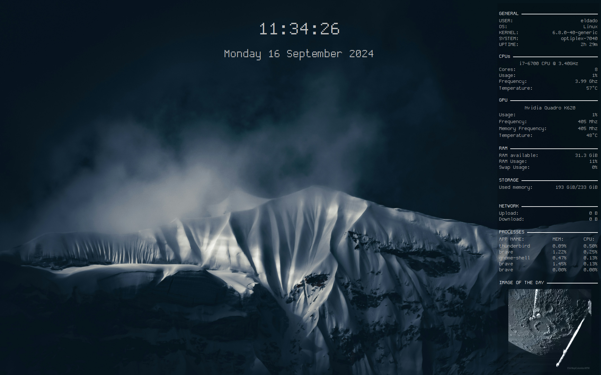

# conky-config

<p align="center">
  
</p>


This (kinda) automated conky config displays 2 windows with various system information, an [image of the day from NASA](https://apod.nasa.gov/apod/astropix.html) and the date and hour.

---

### Features

- Automatic log system for debugging purposes, you can find logs inside this directory. **The log directory if the config has been run at least once**.
- Automatic [NASA's image of the day](https://apod.nasa.gov/apod/astropix.html) download (inside the `img/` folder) and display.


### Prerequisites
- Install [conky](https://github.com/brndnmtthws/conky?tab=readme-ov-file#installing-conky)
- Download the [Dina-Font-TTF-Remastered](https://github.com/zshoals/Dina-Font-TTF-Remastered) font. (adapt the font names inside all `.conf` files if needed)
- (Optional) adapt the last `cut` command inside the `procinfo.sh` script to display correctly the name of your CPU
- Install [calcurse](https://github.com/lfos/calcurse) for the calendar feature

### How to setup

**Before running it**, ensure you have changed the path specified inside the `init.sh` file.

Then, create a symlink with the `init.sh` into the /etc/profile.d/ protected folder.
```sh
# create a symlink of the init.sh into /etc/profile.d/
sudo ln -s ~/PATH/TO/init.sh /etc/profile.d
```

This should run the config at startup. (There is probably a better way to archeive this but this is the way it works for me without having to deal with X startup issues).

### Complementary info

- Some dimentions are absolute and fits best 1080p screens. Feel free to adapt them